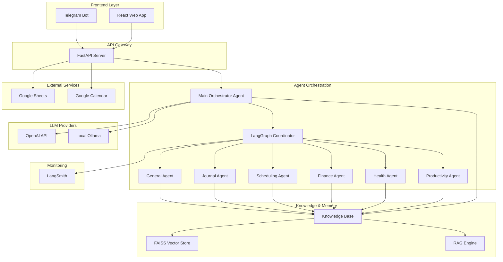

# Design Document

## Overview

The AI Agent Ecosystem is architected as a multi-layered system with specialized AI agents coordinated through LangGraph workflows. The system follows a microservices-inspired architecture with clear separation between the frontend (React + Vite), backend API (FastAPI), agent orchestration layer (LangGraph), knowledge management (FAISS + RAG), and external integrations (Google Services, Telegram).

The core design principle is agent specialization with intelligent coordination, where each agent focuses on specific life domains while maintaining the ability to collaborate and hand off tasks seamlessly. The system emphasizes transparency, user control, and local-first deployment while providing rich interactive experiences.

## Architecture

### High-Level Architecture



### Component Architecture

#### Frontend Components
- **React Web Application**: Main user interface with chat components, knowledge base viewer, analytics dashboard
- **Telegram Bot**: Lightweight notification and command interface
- **Theme System**: Dark/light mode support with responsive design

#### Backend Services
- **FastAPI Server**: RESTful API with WebSocket support for real-time agent interactions
- **Authentication Service**: Google OAuth integration for secure service access
- **Fallback Sheet Service**: In-app spreadsheet component when Google Sheets unavailable
- **LLM Provider Service**: Configurable service supporting both OpenAI API and local Ollama models

#### Agent Layer
- **Main Orchestrator Agent**: Primary agent that handles user interactions and coordinates all other agents
- **LangGraph Coordinator**: Workflow engine managing agent handoffs and state transitions
- **Specialized Agents**: Domain-specific agents with defined responsibilities and capabilities
- **Agent Communication Protocol**: Standardized message passing and state management

## Components and Interfaces

### Agent Specifications

#### Main Orchestrator Agent
- **Responsibilities**: Primary user interaction, intent classification, agent coordination, conversation continuity
- **Capabilities**: Natural language understanding, context management, agent selection and handoff, user session management
- **Integrations**: All specialized agents, knowledge base, user preference system

#### Journal Agent
- **Responsibilities**: User reflection facilitation, daily/weekly/monthly check-ins, emotional support, personal growth tracking
- **Capabilities**: Guided reflection prompts, mood tracking, goal reflection, personal insights generation, milestone celebration
- **Integrations**: Google Sheets (journal entries), knowledge base (reflection patterns), notification system (check-in reminders)

#### Productivity Agent
- **Responsibilities**: Task management, goal tracking, productivity analytics, workflow optimization
- **Capabilities**: Task creation/updates, deadline tracking, productivity pattern analysis
- **Integrations**: Google Sheets (task lists), Google Calendar (time blocking)

#### Health Agent  
- **Responsibilities**: Health routine tracking, wellness reminders, habit formation
- **Capabilities**: Habit tracking, health metric monitoring, wellness suggestions
- **Integrations**: Google Sheets (health logs), notification systems

#### Finance Agent
- **Responsibilities**: Expense tracking, budget management, financial goal monitoring
- **Capabilities**: Transaction categorization, budget analysis, financial insights
- **Integrations**: Google Sheets (financial data), analytics reporting

#### Scheduling Agent
- **Responsibilities**: Calendar management, appointment scheduling, time optimization
- **Capabilities**: Calendar integration, scheduling conflicts resolution, time block suggestions
- **Integrations**: Google Calendar (primary), Google Sheets (scheduling preferences)

#### General Agent
- **Responsibilities**: General assistance, agent coordination, fallback handling
- **Capabilities**: Natural language processing, task routing, general knowledge queries
- **Integrations**: All other agents, knowledge base access

### API Interface Design

#### Core Endpoints
```
POST /api/chat/message - Send message to agent system
GET /api/agents/status - Get current agent states
POST /api/knowledge/query - Query knowledge base
GET /api/knowledge/preferences - Get user preferences
PUT /api/knowledge/preferences - Update user preferences
POST /api/integrations/google/auth - Google OAuth flow
GET /api/analytics/weekly - Get weekly progress reports
GET /api/llm/config - Get current LLM provider configuration
PUT /api/llm/config - Update LLM provider settings (OpenAI/Ollama)
POST /api/llm/test - Test LLM connection and model availability
```

#### WebSocket Endpoints
```
/ws/chat - Real-time chat with agents
/ws/notifications - Real-time notifications and updates
```

### Knowledge Base Schema

#### User Preferences Structure
```json
{
  "user_id": "single_user",
  "preferences": {
    "productivity": {
      "work_hours": "09:00-17:00",
      "break_preferences": "pomodoro",
      "priority_system": "eisenhower"
    },
    "health": {
      "exercise_goals": "30min daily",
      "sleep_schedule": "23:00-07:00",
      "dietary_preferences": ["vegetarian"]
    },
    "finance": {
      "budget_categories": ["food", "transport", "entertainment"],
      "savings_goals": 1000,
      "expense_tracking": "weekly"
    },
    "journal": {
      "reflection_frequency": "daily",
      "check_in_time": "21:00",
      "reflection_topics": ["gratitude", "challenges", "goals"],
      "mood_tracking": true
    },
    "llm_provider": {
      "provider": "openai",
      "openai_api_key": "encrypted_key",
      "openai_model": "gpt-4",
      "ollama_endpoint": "http://localhost:11434",
      "ollama_model": "llama2",
      "fallback_enabled": true
    }
  },
  "patterns": {
    "daily_routines": [],
    "interaction_history": [],
    "success_metrics": {},
    "reflection_insights": []
  }
}
```

## Data Models

### Agent State Model
```python
class AgentState:
    agent_id: str
    agent_type: AgentType
    current_task: Optional[Task]
    context: Dict[str, Any]
    last_active: datetime
    capabilities: List[str]
```

### Task Model
```python
class Task:
    task_id: str
    title: str
    description: str
    assigned_agent: str
    status: TaskStatus
    priority: Priority
    due_date: Optional[datetime]
    dependencies: List[str]
    metadata: Dict[str, Any]
```

### Knowledge Entry Model
```python
class KnowledgeEntry:
    entry_id: str
    user_id: str
    category: str
    content: str
    embedding: List[float]
    created_at: datetime
    updated_at: datetime
    tags: List[str]
```

### Integration Models
```python
class GoogleSheetsConfig:
    sheet_id: str
    sheet_name: str
    range: str
    permissions: List[str]
    
class GoogleCalendarConfig:
    calendar_id: str
    sync_enabled: bool
    notification_settings: Dict[str, Any]

class LLMProviderConfig:
    provider: Literal["openai", "ollama"]
    openai_api_key: Optional[str]
    openai_model: str = "gpt-4"
    openai_base_url: Optional[str]
    ollama_endpoint: str = "http://localhost:11434"
    ollama_model: str = "llama2"
    fallback_enabled: bool = True
    max_tokens: int = 4000
    temperature: float = 0.7
```

## Error Handling

### Agent Error Recovery
- **Agent Failure**: Automatic failover to General Agent with context preservation
- **Task Timeout**: Escalation to user with options to retry, modify, or cancel
- **Integration Failure**: Graceful fallback to in-app alternatives

### Data Consistency
- **Knowledge Base Conflicts**: Last-write-wins with user notification for manual resolution
- **Google Services Outage**: Automatic fallback to local storage with sync when restored
- **Agent State Corruption**: State reconstruction from interaction history

### User Experience Errors
- **Invalid Input**: Clear error messages with suggested corrections
- **Permission Denied**: Guided re-authentication flow
- **Network Issues**: Offline mode with queued operations

## Testing Strategy

### Unit Testing
- **Agent Logic**: Individual agent decision-making and task handling
- **API Endpoints**: Request/response validation and error handling
- **Knowledge Base**: RAG retrieval accuracy and preference management
- **Integration Services**: Google API interaction and fallback mechanisms

### Integration Testing
- **Agent Coordination**: Multi-agent workflows and task handoffs
- **End-to-End Flows**: Complete user journeys from input to outcome
- **External Service Integration**: Google Sheets/Calendar integration reliability
- **Real-time Features**: WebSocket communication and notification delivery

### User Acceptance Testing
- **Agent Reasoning Transparency**: Verify decision-making visibility
- **Knowledge Base Interaction**: Test preference viewing and editing
- **Cross-Platform Experience**: Web app and Telegram bot consistency
- **Performance**: Response times and system responsiveness

### Testing Tools and Frameworks
- **Backend**: pytest, FastAPI TestClient, mock Google APIs
- **Frontend**: Jest, React Testing Library, Cypress for E2E
- **Agent Testing**: LangGraph testing utilities, conversation simulation
- **Load Testing**: Locust for API performance testing

## Additional Design Considerations

### Suggested Enhancements

#### Context Awareness System
- **Cross-Agent Context Sharing**: Agents should share relevant context (e.g., if Health Agent notes poor sleep, Productivity Agent adjusts expectations)
- **Temporal Context**: System should understand time-based patterns and adjust behavior accordingly
- **Emotional Context**: Journal Agent insights should inform other agents' interaction styles

#### Proactive Intelligence
- **Pattern Recognition**: System should identify recurring patterns and proactively suggest optimizations
- **Predictive Assistance**: Based on historical data, agents should anticipate user needs
- **Smart Notifications**: Intelligent timing of reminders based on user behavior patterns

#### Learning and Adaptation
- **Feedback Loop**: System should learn from user acceptance/rejection of suggestions
- **Personalization Engine**: Continuous refinement of agent behavior based on user interactions
- **Success Metric Tracking**: Automatic identification of what works best for the user

#### LLM Provider Flexibility
- **Provider Toggle**: Easy switching between OpenAI API and local Ollama models through UI settings
- **Configuration Management**: Secure storage of API keys with encryption, model selection per provider
- **Automatic Fallback**: If primary provider fails, automatically switch to backup provider
- **Cost Optimization**: Local Ollama for development/testing, OpenAI for production when needed
- **Model Selection**: Support for different models within each provider (GPT-4, GPT-3.5, Llama2, etc.)

#### Integration Enhancements
- **Smart Fallbacks**: When Google services are unavailable, maintain full functionality with local alternatives
- **Data Synchronization**: Seamless sync between local and cloud data when connectivity is restored
- **Export/Import**: Easy data portability for user control and backup

#### User Experience Improvements
- **Agent Personality**: Each agent should have a consistent, helpful personality that matches their domain
- **Conversation Memory**: Maintain conversation context across sessions and agent handoffs
- **Progressive Disclosure**: Show simple interfaces initially, with advanced features available on demand
- **Customizable Dashboard**: User-configurable views of their data and agent interactions