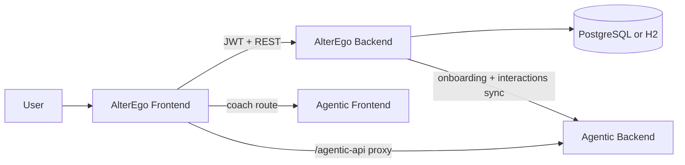

# AlterEgo Time Tracking

AlterEgo is a full-stack productivity platform that combines time tracking, onboarding-based coaching, AI-assisted command flows, and knowledge sync into Agentic.

## Product Overview

### Core workflows
- Live timer start/stop.
- Manual time-entry creation and editing.
- Project and tag management.
- Onboarding profile and planner preferences.
- AI command assistant for guided productivity actions.

### Habit momentum workspace
- Habit tracking with streak and completion history.
- Contribution-style grid and 30-day line trend.
- Habit snapshot sync to Agentic knowledge APIs.

### Cross-app intelligence bridge
- AlterEgo backend sends onboarding and selected interaction events to Agentic.
- Agentic frontend can be embedded in AlterEgo through coach routes.

## Architecture



## Current Agentic Sync Coverage

| Domain | Source | Sync Status | Destination |
|---|---|---|---|
| Onboarding role/goals/preferences/mentor/planner | OnboardingController | Synced | Agentic /api/knowledge/onboarding |
| Time entries (completed or edited) | TimerController | Synced | Agentic /api/knowledge/interactions |
| Time-entry backfill | TimerController backfill endpoint | Synced | Agentic /api/knowledge/interactions |
| Habit snapshot summary/trend | TaskManager + AgenticSyncController | Synced | Agentic /api/knowledge/interactions |
| Daily checkups | OnboardingController checkup endpoint | Synced | Agentic checkup APIs |

## Known Sync Boundaries

These data points are currently not independently synced into Agentic knowledge as first-class records:

- Project catalog CRUD events as standalone knowledge entries.
- Tag catalog CRUD events as standalone knowledge entries.
- Local-only todo tasks from task store.
- Time-entry delete events as explicit remove operations in Agentic knowledge.
- Active running timer state before endTime is set.

## Repository Layout

```text
AlterEgo_TimeTracking/
├── backend/
│   ├── src/main/java/...          # Spring Boot API, security, domain services
│   └── src/main/resources/        # environment-specific config
├── frontend/
│   ├── src/components/            # timer, habits, onboarding, AI chat UI
│   ├── src/store/                 # local task/habit state
│   └── .env.example               # frontend runtime config
├── POCs/
└── DEPLOYMENT_RENDER_FRONTEND_GUIDE.md
```

## Technology Stack

| Layer | Technologies |
|---|---|
| Frontend | React 18, TypeScript, Vite, Tailwind CSS |
| Backend | Spring Boot 3.4, Spring Security, Spring Data JPA |
| Auth | JWT access/refresh flow |
| Data | PostgreSQL (production), H2 (local) |
| AI integration | LangChain4j + Agentic bridge endpoints |
| Deployment | Render (backend), Vercel (frontend) |

## Local Development

### Prerequisites
- Java 17
- Node.js 18+
- npm

### Backend

```bash
cd backend
./mvnw spring-boot:run
```

### Frontend

```bash
cd frontend
npm install
npm run dev
```

Defaults:
- Backend: http://localhost:8080
- Frontend: http://localhost:5173

## Configuration

### Backend
Set in application properties or environment variables:

- OPENAI_API_KEY
- JWT_SECRET
- APP_CORS_ALLOWED_ORIGIN_PATTERNS
- AGENTIC_SYNC_ENABLED
- AGENTIC_SYNC_BASE_URL

### Frontend
Set using frontend environment files:

- VITE_TIMETRACKER_API_ORIGIN
- VITE_AGENTIC_API_ORIGIN
- VITE_AGENTIC_COACH_URL
- VITE_AGENTIC_API_PREFIX

## Key API Endpoints

- POST /api/auth/login
- POST /api/auth/refresh
- POST /api/timers/start
- POST /api/timers/{id}/stop
- POST /api/timers/addTimer
- PUT /api/timers/{id}
- DELETE /api/timers/{id}
- POST /api/timers/sync/agentic/backfill
- POST /api/onboarding/onboardNewUser
- PUT /api/onboarding/updateOnboardingData
- POST /api/agentic/habits/snapshot

## Data Integrity Rules

- Active timers are represented with endTime = null.
- Manual entries require both startTime and endTime.
- Manual entries must satisfy endTime > startTime.
- Time-entry sync only occurs for entries with endTime populated.

## Deployment

For full deployment and keepalive guidance, see DEPLOYMENT_RENDER_FRONTEND_GUIDE.md.
