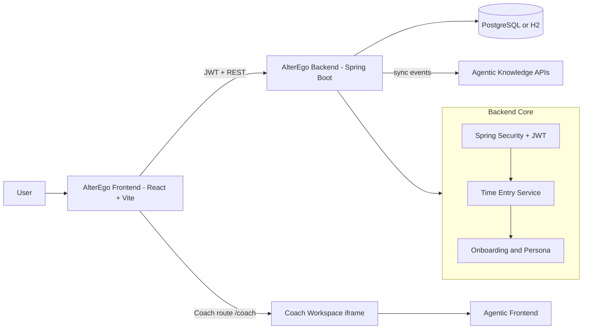
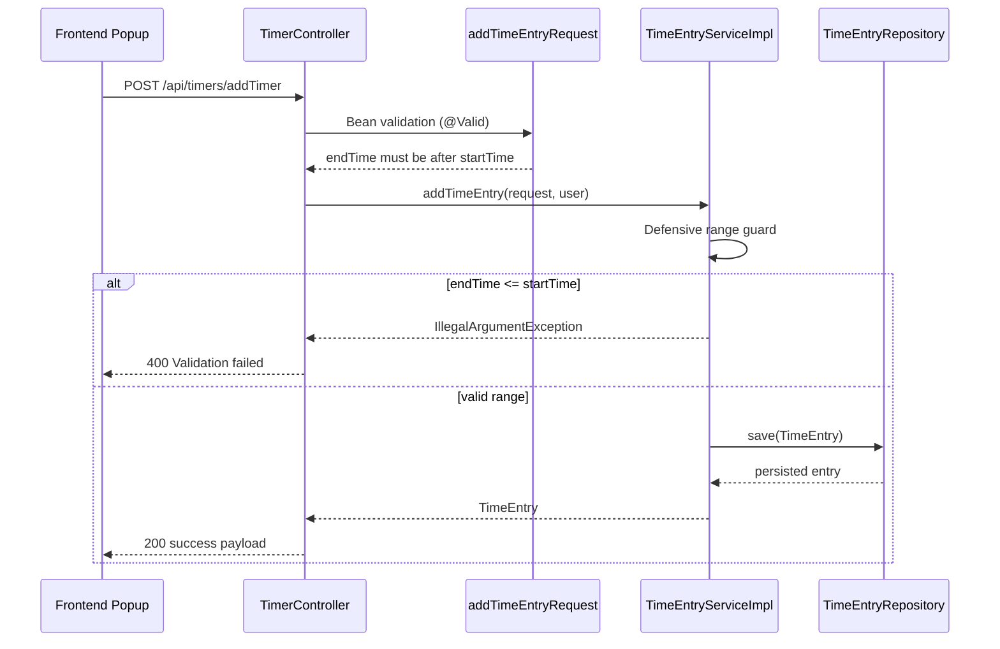
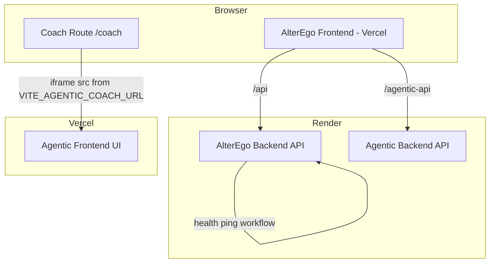

# AlterEgo Time Tracking Platform

AlterEgo is an AI-assisted productivity platform that combines precise time tracking, guided planning, onboarding-based personalization, and cross-app coaching.

This repository demonstrates full-stack product engineering across React, Spring Boot, secure auth, AI orchestration, and cloud deployment patterns.

## Product Walkthrough

Watch the application demo:

<a href="https://drive.google.com/file/d/1uSWtXf84HJaQ7-PIMalHH_3yC6s1vLiD/view?usp=sharing">
  
</a>

## Why This Project Is Portfolio-Ready

- End-to-end architecture: React frontend, Spring Boot backend, JWT security, relational persistence, and AI integrations.
- Product depth: timers, manual entries, analytics, goals, onboarding, and AI chat in one cohesive UX.
- Real deployment constraints solved: Render free-tier wake strategy, CORS normalization, Vercel frontend + Render API split.
- Cross-system integration: AlterEgo UI bridges to Agentic coach UI while syncing operational context to knowledge APIs.

## Core Capabilities

### Time and planning engine
- Start and stop live timers.
- Manual entry support for backfilling work.
- Projects, tags, and billable context.
- Calendar-driven planning and time blocking.

### AI-first coaching
- Personalized mentor persona from onboarding.
- Context-aware chat flows for productivity actions.
- Agentic knowledge sync hooks on timer events.

### Security and reliability
- JWT authentication and protected API surface.
- CORS allow patterns for local and cloud frontends.
- Health endpoints for uptime checks and keep-alive workflows.

## Architecture

### System context



### Manual time entry validation path



### Production deployment topology



## Technology Stack

| Layer | Technologies |
|---|---|
| Frontend | React 18, TypeScript, Vite, Tailwind CSS, Framer Motion |
| Backend | Spring Boot 3.4, Spring Security, Spring Data JPA, Bean Validation |
| Auth | JWT (access + refresh token flow) |
| Data | PostgreSQL (prod), H2 (local dev) |
| AI integration | LangChain4j + OpenAI model support, Agentic sync endpoints |
| Deployment | Render (backend), Vercel (frontend), GitHub Actions keepalive |

## Repository Layout

```text
AlterEgo_TimeTracking/
├── backend/                       # Spring Boot API
│   ├── src/main/java/...          # domain, controller, service, security
│   └── src/main/resources/        # application config
├── frontend/                      # React + Vite client
│   ├── src/components/            # UI features and coach workspace bridge
│   └── .env.example               # frontend runtime origin settings
├── POCs/                          # experimental implementations
└── DEPLOYMENT_RENDER_FRONTEND_GUIDE.md
```

## Run Locally

### Prerequisites
- Java 17
- Maven 3.8+ (or Maven Wrapper)
- Node.js 18+
- npm

### 1) Start backend

```bash
cd backend
./mvnw spring-boot:run
```

Default local backend: `http://localhost:8080`

### 2) Start frontend

```bash
cd frontend
npm install
npm run dev
```

Default local frontend: `http://localhost:5173`

### 3) Optional POC runtime

```bash
cd POCs
pip install -r requirements.txt
python Realtime_Text-To-Speech_Impl.py
```

## Configuration

### Backend properties

`backend/src/main/resources/application.properties` and `application-prod.properties` support:

- `OPENAI_API_KEY`
- `JWT_SECRET`
- `APP_CORS_ALLOWED_ORIGIN_PATTERNS`
- `AGENTIC_SYNC_ENABLED`
- `AGENTIC_SYNC_BASE_URL`

### Frontend environment

Use `frontend/.env.example` for standalone deployments:

- `VITE_TIMETRACKER_API_ORIGIN`
- `VITE_AGENTIC_API_ORIGIN`
- `VITE_AGENTIC_COACH_URL`
- `VITE_AGENTIC_API_PREFIX`

## API Highlights

- `POST /api/auth/login` and `POST /api/auth/refresh`
- `POST /api/timers` start timer
- `PUT /api/timers/{id}/stop` stop timer
- `POST /api/timers/addTimer` manual add entry
- `GET /health` and `GET /api/health` service checks

## Data Integrity Rules

- Active timers are represented with `endTime = null`.
- Manual entries must provide both `startTime` and `endTime`.
- Manual entries enforce strict ordering: `endTime > startTime`.
- Duration is computed from the normalized time window.

## Deployment Notes

Production setup uses Vercel frontends and Render APIs.

For exact deployment steps, keepalive setup, and service mapping, see:
- `DEPLOYMENT_RENDER_FRONTEND_GUIDE.md`

## What This Project Demonstrates

- Product-minded backend design with clear domain constraints.
- Resilient cloud deployment patterns under free-tier limits.
- Pragmatic AI integration with guardrails and interoperability.
- Ownership from UX and architecture through operations.
